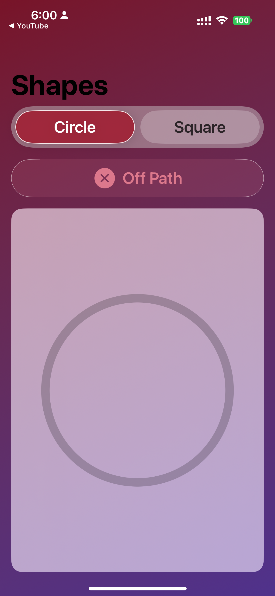
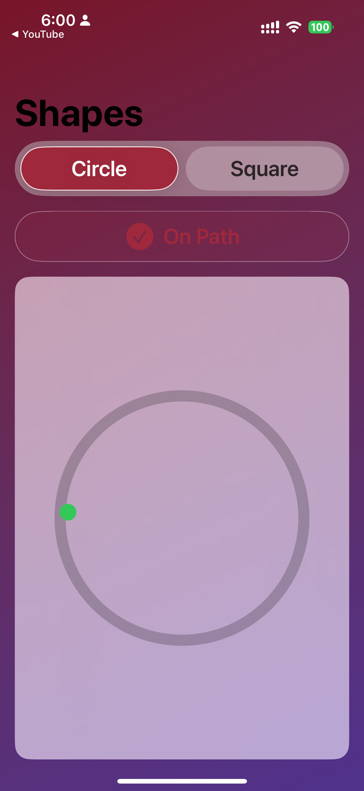

# Reflection & Reporting
## 1. Summary
This app is a SwiftUI-based project that allows users to trace simple shapes (circle and square) on screen. While tracing, the app provides multimodal feedback: haptics and tonal audio when the finger is on the correct path, with stronger feedback at corners. The interface is styled with a maroon-purple gradient, capsule-style shape selector, and a status badge that indicates whether the trace is on or off the path.

### Screenshots

  
  

## 2. Focus Areas

I prioritized:

- **Shape tracing logic**: making sure path detection worked reliably for circles and squares, since this is the foundation of the app.  
- **Feedback integration**: ensuring continuous haptic and tonal feedback when on-path, and stronger cues at vertices, because clear multimodal feedback is central to the user experience.  
- **Accessibility**: adding VoiceOver labels and large tappable regions so the app can be inclusive and usable for people relying on assistive technologies.  
- **UI polish (secondary)**: after completing core functionality, I added a capsule selector, status chip, and maroon–purple gradient theme to make the interface more engaging and aligned with modern SwiftUI design.  

## 3. Time Allocation

I spent roughly 11 hours on this project, distributed as follows:

- **Shape tracing logic**: ~3 hours – implementing reliable path detection for circle and square.  
- **Feedback integration**: ~2.5 hours – adding haptic, audio, and vertex-specific feedback.  
- **Accessibility**: ~2 hours – VoiceOver labels, announcements, and large tappable regions.  
- **Unit testing**: ~2 hours – writing and debugging tests for path logic and feedback rules.  
- **UI polish**: ~1 hour – adding capsule selector, status chip, and gradient theme.  
- **Report & README**: ~1.5 hours – documenting design choices, trade-offs, and reflections.

 ## 4. Decisions & Trade-offs

- **SwiftUI-only UI**: I kept all interface elements in SwiftUI (NavigationStack, capsule selector, status chip, canvas) to fully meet the requirement of avoiding UIKit. For haptic feedback, I used CoreHaptics directly instead of relying on UIKit fallbacks.  
- **Shape scope**: Limited shapes to circle and square since the requirement was “at least two.” This kept the logic and unit testing focused and reliable instead of overcomplicating with extra shapes.  
- **Feedback design**: Implemented continuous haptics and tonal feedback while tracing, with stronger pulses and pitch nudges at vertices. This balance demonstrated multimodal feedback without overwhelming the user.  
- **Accessibility**: Added VoiceOver labels, hints, and status announcements. A trade-off is that full interactive tracing is limited under VoiceOver (drag vs. explore by touch), but I prioritized compatibility and clear feedback for inclusivity.  
- **UI polish**: After core functionality worked, I added a maroon–purple gradient theme, capsule selector, and status chip. This was optional, but made the app more presentable and cohesive.  

## 5. Least Complete Area  

- **Accessibility**: VoiceOver users currently hear “On path/Off path” announcements, but full tracing isn’t practical because drag gestures conflict with explore-by-touch. With more time, I would add a dedicated VoiceOver mode (e.g., custom accessibility actions or guided tracing) so screen reader users can actively participate.  

- **Feature Extensions**: I would add more shapes (triangle, star) and refine the audio feedback with smoother pitch variation. These changes would make the app more engaging and useful for both accessibility and educational contexts.  

## 6. Research Relevance
This app could be used to study fine motor skill development, since tracing shapes requires accuracy and control of movement.  
The multimodal feedback (haptics, audio, and visual status) allows researchers to compare how different sensory channels influence tracing performance.  
The accessibility features—clear labels, announcements, and large touch regions—make it possible to explore how screen reader users interact with spatial tracing tasks.  
With further extensions, such as additional shapes and smoother audio feedback, the app could also serve as a basis for evaluating inclusive educational tools or adaptive accessibility techniques.
